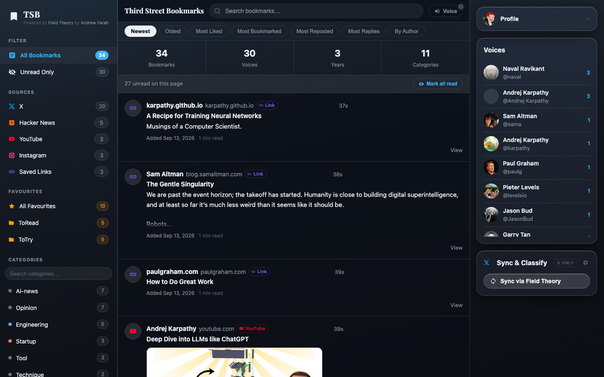
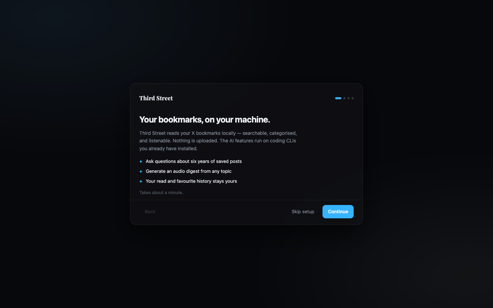
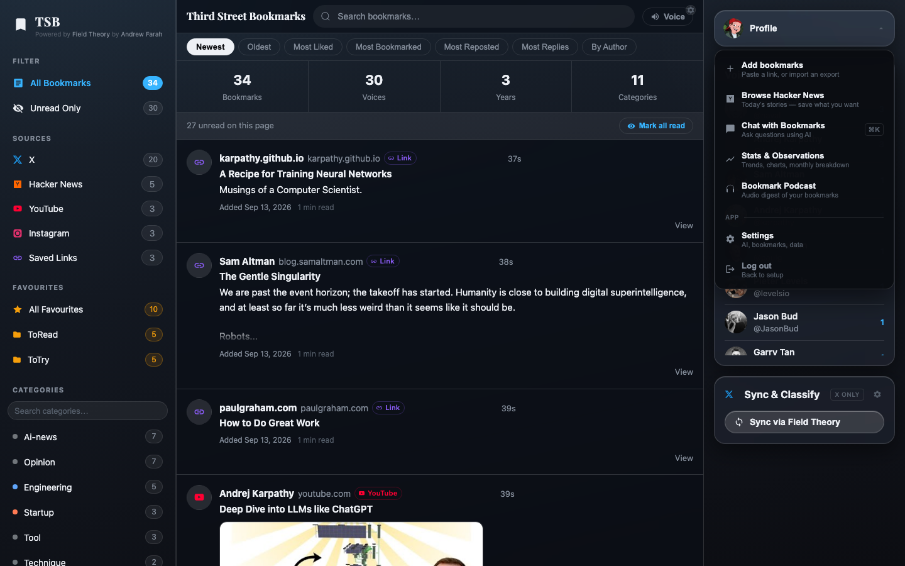
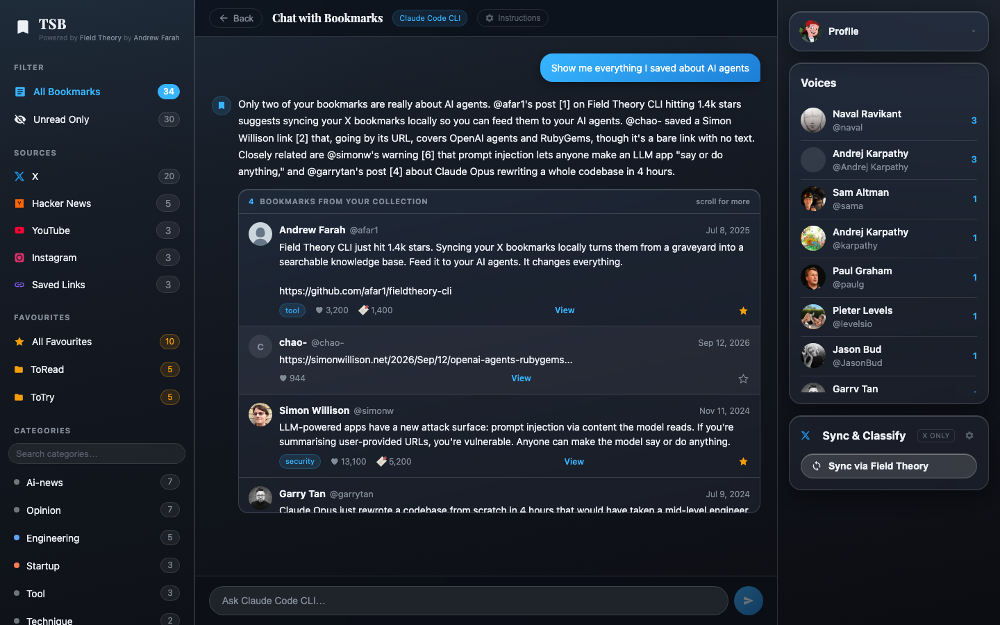
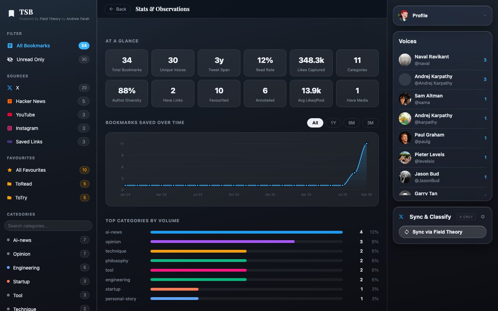
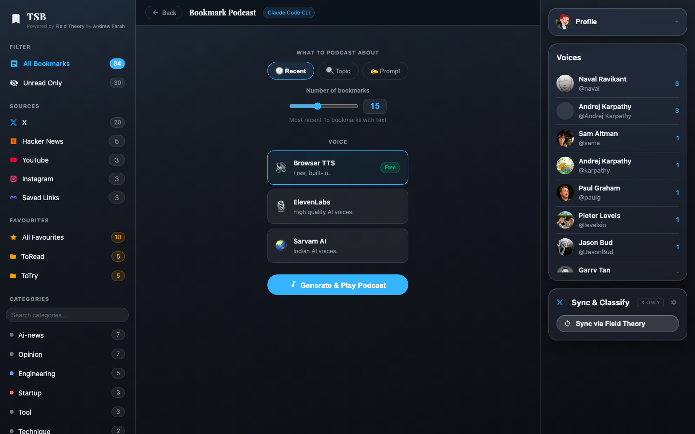
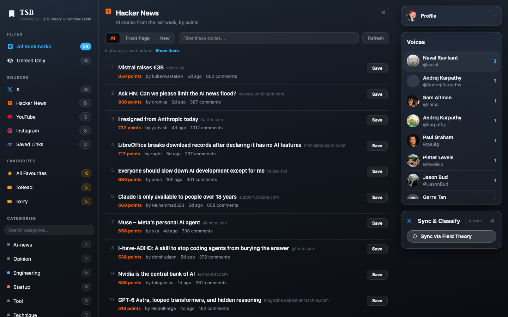
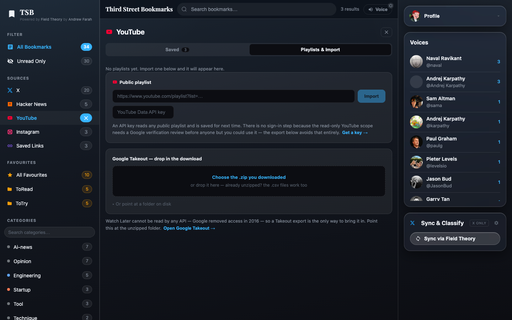
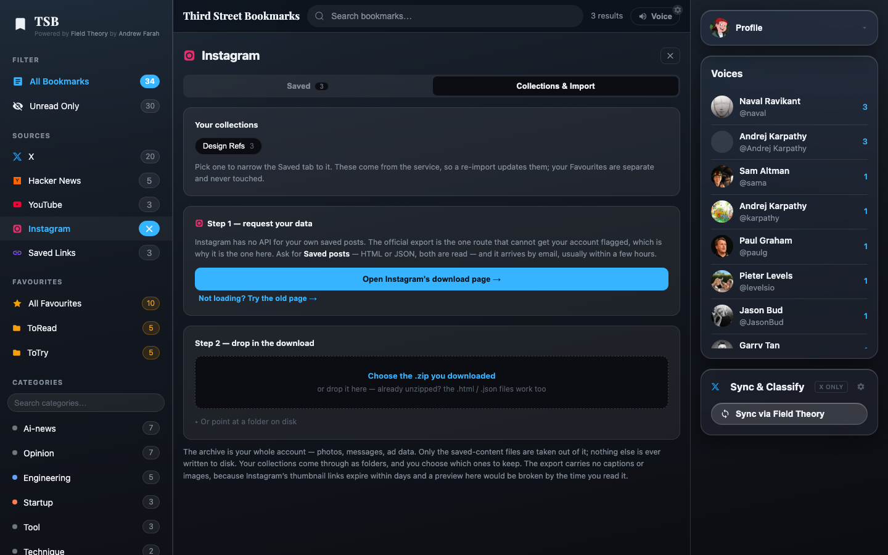

# Third Street Bookmarks

A local-first bookmark reader that gathers everything you save — X, Hacker News,
YouTube, Instagram, and any loose link — into one searchable, categorised,
listenable library. It runs in your browser against a small local server.
Everything stays on your machine, and the AI features run on the coding CLIs you
already have installed: no API key, no upload, no account.

> Prefer a native app? [Third Street Bookmarks for macOS](https://github.com/mayanksagar26/third-street-bookmarks-macapp)
> is the same app in a Tauri shell. Both builds share `~/.tsb`, so they open the
> same collection with the same read and favourite history.



---

## What it does

- **Every source in one feed** — X (via [Field Theory](https://github.com/afar1/fieldtheory-cli)), Hacker News, YouTube, Instagram and saved links, each with its own place in the sidebar
- **Onboarding** — a skippable first-run flow that finds your coding CLI and your existing bookmarks file
- **Browse Hacker News live** — AI, Front Page and New tabs; nothing is stored until you press Save
- **Imports** — YouTube videos, public playlists and Google Takeout; Instagram's official export (ZIP, JSON or HTML)
- **Favourites** — multi-folder, spanning every source, renamable, never touched by a sync
- **Folders** — Instagram collections and YouTube playlists land as folders marked with their service
- **AI Chat** — ask questions in plain English, with Markdown answers and results you can file into folders
- **AI on every card** — explain a bookmark in context (this one call may use web search, never web fetch)
- **Bookmark Podcast** — turn a slice of your collection into an audio digest
- **Stats & Observations** — reading rate, author diversity, categories, saving patterns
- **Voice** — browser TTS (free), ElevenLabs or Sarvam AI
- **Notes, labels, read/unread** — kept in an app-owned SQLite, so no sync ever resets them
- **Settings** — AI backend, classify engine, bookmarks location, and a reading font (system, Inter, serif, hand-drawn, mono — all bundled, no network)
- **Profile picture** — TJ by default, any of the Recess gang (Spinelli, Gretchen, Gus, Vince, Mikey, King Bob, Miss Finster), or upload your own

---

## What it looks like

**Onboarding** — four steps, skippable:



**Tools** — adding, browsing and the AI features live in one menu:



**Chat with your bookmarks** — ask in plain English; the answer cites the
bookmarks it used, and runs on your local Claude Code or Codex CLI:



**Stats & Observations** — reading rate, author diversity, categories, saving
patterns over time:



**Bookmark Podcast** — an audio digest of recent bookmarks, a topic or a
prompt, in browser TTS, ElevenLabs or Sarvam voices:



---

## Getting started

### Prerequisites

- Node.js 20+
- Python 3.9+ (classify / export scripts)
- Optional: [Claude Code](https://claude.ai/code) or [Codex CLI](https://github.com/openai/codex) for the AI features
- Optional: [Field Theory CLI](https://github.com/afar1/fieldtheory-cli) for syncing X bookmarks

### Install and run

```bash
git clone https://github.com/mayanksagar26/third-street-bookmarks
cd third-street-bookmarks

npm run setup        # installs root, server (express + better-sqlite3) and client

npm run build        # builds the UI into client/dist
npm start            # serves UI + API → http://127.0.0.1:3456
```

For development with hot reload:

```bash
npm run dev          # API on :3456, Vite on :5173 (proxies /api)
```

Open `http://localhost:5173` in dev, or `http://localhost:3456` after a build.

### First run

The app walks you through picking an AI CLI and finding your bookmarks. To just
look around, point it at the sample collection:

```bash
DATA_PATH=bookmarks.sample.json npm start
```

### Tests

```bash
npm test             # ingest parsers, id namespacing, merge rules, sorts, markdown
```

---

## Sources

One collection, several origins. **All Bookmarks** / **Unread Only** answers
*read or unread*; the **Sources** list answers *from where*. The two compose.
Clicking a source opens it: every source shows what you kept from it, and every
source but X adds a tab for the surface that puts things in.

| Source | How it gets in | Needs |
|---|---|---|
| **X** | `ft sync` — the only source **Sync & Classify** drives | Field Theory |
| **Hacker News** | Browse the front page or an AI feed, save what you want | nothing |
| **YouTube** | Paste a video, import a public playlist, or a Takeout export | nothing / API key / export |
| **Instagram** | Official data export | export |
| **Saved Links** | Paste any URL | nothing |

**X sync** borrows cookies from the browser you actually read X in — pick it in
the Sync & Classify settings (Chrome, Chromium, Brave, Edge, Comet, Dia, Helium or
Firefox). Sync then classifies only what it brought in.

**Hacker News** is browsed, not synced. Thirty front-page stories arriving every
morning would bury the things you chose, so stories already in your collection
drop out of the list:



**YouTube** has no sign-in flow on purpose. Paste a video (no credentials), add
an API key once for public playlists, or use Google Takeout for Liked and
**Watch Later** — which no API can read.



**Instagram** has no API for saved posts, and automating a logged-in session
risks a checkpoint on your account. So the app links you to Instagram's export
page; drop the ZIP in as it downloaded. Only `saved_posts` and
`saved_collections` are ever extracted — the rest of your account archive is
never decompressed. Pick *All time* when requesting the export, or older
collections are left out.



Both importers are two-phase: read the file, show what's inside, import only
what you tick.

---

## Where your data lives

```
~/.tsb/                 shared with the macOS app
├── state.db            read · favourites · labels · notes · voice prefs
├── settings.json
├── sources/            hn · yt · ig · link, owned by this app
├── imports/            exports you uploaded, kept for re-import
├── avatar.jpeg         your uploaded profile picture, if any
└── auth-token          per-launch API credential (0600)
```

X bookmarks stay in Field Theory's `bookmarks.json`, wherever Settings →
Bookmarks points. Ids are namespaced on read (`hn:38104219`, `yt:dQw4w9WgXcQ`)
so a Hacker News item never inherits a tweet's state.

Upgrading from 1.x: on first start the server copies the repo-root
`settings.json` into `~/.tsb` and keeps using your repo-root `bookmarks.json`.

Override locations with `TSB_DATA_DIR`, `DATA_PATH` (X bookmarks file) and
`STATE_DB`.

---

## Security model

The server holds every bookmark you've saved and can spawn a coding agent, so
"it's only localhost" isn't treated as a threat model.

| Control | What it removes |
|---|---|
| Binds `127.0.0.1` only | The LAN |
| Per-launch bearer token | Other local processes and any website you visit. `npm start` writes it into the served page; the Vite dev proxy reads it from `~/.tsb/auth-token` |
| Origin + Host validation (API and page) | DNS rebinding and cross-site reads |
| Path validation on adopt / import | Arbitrary file reads — symlink-resolved, home-scoped |
| Read-only agent invocation | Prompt injection turning into code execution. Claude runs with Bash, Write, Edit, WebFetch and Task denied; Codex runs `--sandbox read-only` |
| Ingest fetches are https-only, 4 MB cap, 15 s timeout | Hostile or broken endpoints |

Card-level AI explanations may use `WebSearch` (never `WebFetch`); set
`"aiWebSearch": false` in `~/.tsb/settings.json` to turn that off.

---

## Classifying bookmarks

```bash
python3 classify.py                  # offline regex
python3 classify.py --backend=claude # Claude Code CLI
python3 classify.py --backend=codex  # Codex CLI
```

Or use **Sync & Classify** in the right panel.

---

## Stack

| Layer | Tech |
|---|---|
| Frontend | React 18 + Vite |
| Backend | Express (port 3456) + better-sqlite3 |
| Sync | Field Theory CLI |
| AI | `claude -p` / `codex exec` — local CLIs |
| Voice | SpeechSynthesis, ElevenLabs, Sarvam AI |

---

## Changelog

### 2.0.0 — 2026-09-13

Brings the web app level with the macOS app.

- **Every bookmark in one place** — Hacker News, YouTube, Instagram and saved links join X, each as a source you can open, with per-source counts and sorts.
- **Hacker News browse pane**, **YouTube** (video, playlist, Takeout) and **Instagram export** importers, and **save any URL**.
- **Onboarding and Settings** — detects Claude Code / Codex, finds your bookmarks file, and lets you pick a reading font.
- **Chat** renders Markdown and can file results into favourite folders; an **AI button on every card** explains a bookmark.
- **Sync from the browser you use**, classify only what a sync brings in, and clearer sync errors.
- **New theme** built around the logo; long bookmarks clamp; keyboard-reachable sidebar rows.
- **Hardened local API** — loopback bind, per-launch token, Origin/Host checks, path validation, sandboxed agents.
- **Data moves to `~/.tsb`**, shared with the macOS app; 1.x settings and bookmarks are picked up automatically.
- **Profile picture picker** — TJ, seven illustrated Recess characters, or an uploaded photo (cropped to a square and kept in `~/.tsb`).
- **Removed:** birdclaw (and its Liked Tweets, Inbox Triage and AI Digests views), Forgotten Gems.

### 1.2.0 — 2026-05-30

- Multi-folder favourites, folder rename, read/unread fixes.

### 1.1.0 — 2026-05-30

- Pluggable sync sources (Field Theory + birdclaw), smart merge, app-owned state DB.

### 1.0.0

- Initial release: X bookmark reader on Field Theory with AI chat, podcast, stats and voice.

---

## Credits

- **[Field Theory CLI](https://github.com/afar1/fieldtheory-cli)** by [Andrew Farah](https://x.com/andrewfarah)
- Built with React, Express, Vite, better-sqlite3
- AI features powered by Claude Code CLI / Codex CLI

Screenshots show the bundled sample collection plus a handful of public Hacker
News, YouTube and web links — not real bookmark data. The Instagram entries are
fixtures in the export's shape.
